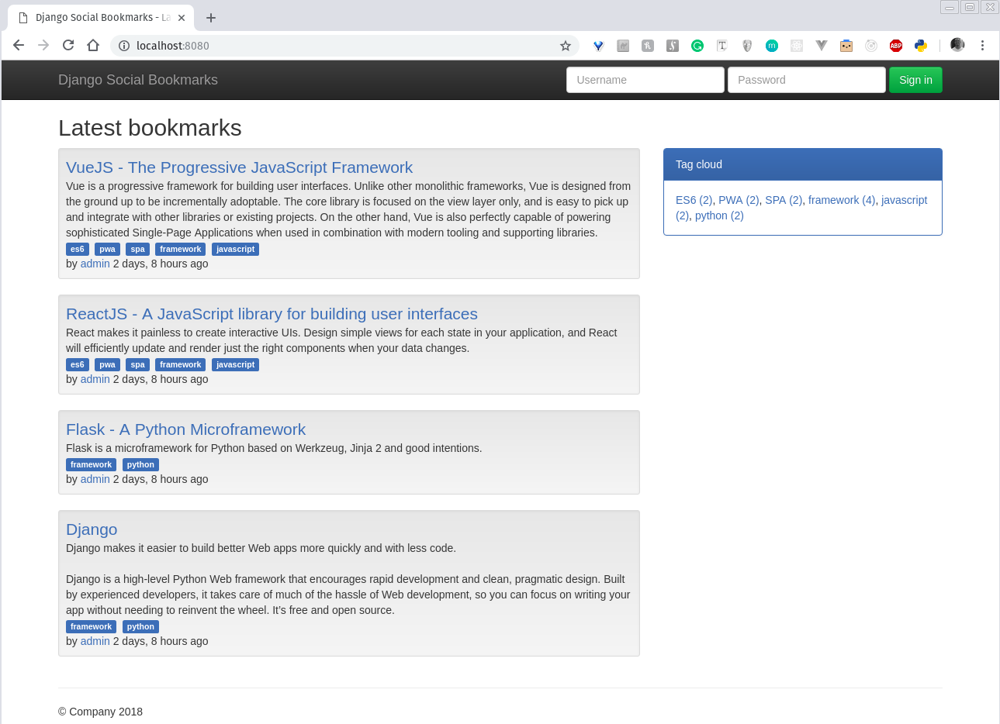
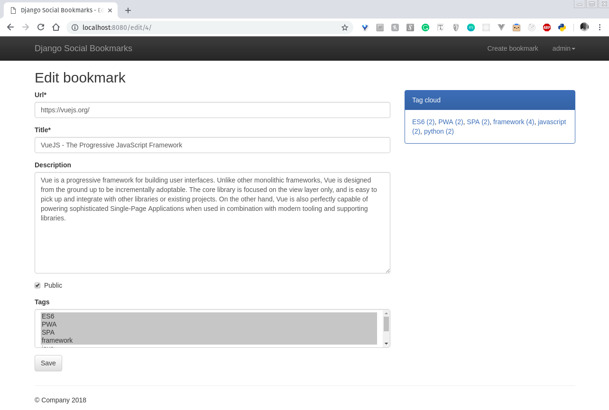

# Django Social Bookmarks
### The ultimate example boilerplate code for Django microservices with Docker
Django Social Bookmarks is an open-source example boilerplate code written in Python that focuses on quick development and clean, pragmatic design with 12 Factors of App Methodology. (see design principle links section below)

It's a bookmark application similar to Delicious or Pinboard developed using the latest Python Django web technologies: Django 1.11 LTS, PostgreSQL, Gunicorn, Nginx together with best practice DevOps Docker container.


### TL;DR
### FAQ: Why are we doing this?
I've successfully setup this stack a couple times now and have seen it done in professional settings so the only reason is basically "monkey see monkey do". Why not simply run a Django or Flask server that takes requests straight from port 80 instead of the reverse proxy?

### Answer:
This reddit thread simply answered it -->
https://www.reddit.com/r/Python/comments/68phcu/why_nginxgunicornflask/

## Installation instructions

#### Prerequisite

| Tool | Link |
| ------ | ------ |
| Docker | https://www.docker.com/ |

### Docker
Django Social Bookmarks is very easy to install and deploy with Docker containers.

By default, the main web app will expose port 8080, so change this within the docker-compose file if necessary. When ready, simply use the docker-compose.yml to build and deploy the images.

```sh
git clone https://github.com/ntt2k/OnlineBanking.git
cd OnlineBanking
docker-compose up
```

### Login Social Bookmarks Web App

http://localhost:8080/

| username | password |
| ------ | ------ |
| admin | adminpassword |




### The 12 Factors of App Methodology Microservices check-list

https://blog.scottlogic.com/2017/07/17/successful-microservices-with-12factor-app.html

https://www.cuelogic.com/blog/12-factor-design-methodology-and-cloud-native-applications

https://hub.packtpub.com/how-to-build-12-factor-design-microservices-on-docker-part-1/

| # | Factor | Description | Status
| ------ | :------: | :------ | :------: |
| 1 | Codebase | There should be exactly one codebase for a deployed service with the codebase being used for many deployments. | :white_check_mark:
| 2 | Dependencies | All dependencies should be declared, with no implicit reliance on system tools or libraries. | :white_check_mark:
| 3 | Config | Configuration that varies between deployments should be stored in the environment. | :x:
| 4 | Backing services | All backing services are treated as attached resources and attached and detached by the execution environment. | :white_check_mark:
| 5 | Build, release, run | The delivery pipeline should strictly consist of build, release, run. | :white_check_mark:
| 6 | Processes | Applications should be deployed as one or more stateless processes with persisted data stored on a backing service. | :x:
| 7 | Port binding | Self-contained services should make themselves available to other services by specified ports. | :white_check_mark:
| 8 | Concurrency | Concurrency is advocated by scaling individual processes. | :x:
| 9 | Disposability | Fast startup and shutdown are advocated for a more robust and resilient system. | :white_check_mark:
| 10 | Dev/Prod parity | All environments should be as similar as possible. | :white_check_mark:
| 11 | Logs | Applications should produce logs as event streams and leave the execution environment to aggregate. | :x:
| 12 | Admin Processes | Any needed admin tasks should be kept in source control and packaged with the application. | :x: