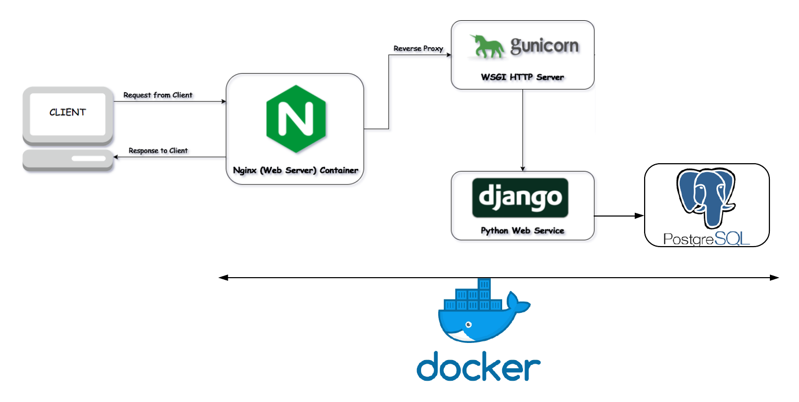

# Django Social Bookmarks
### The ultimate example boilerplate code for Django microservices with Docker

### TL;DR
### FAQ: Why are we doing this?
I've successfully setup this stack a couple times now and have seen it done in professional settings so the only reason is basically "monkey see monkey do". Why not simply run a Django or Flask server that takes requests straight from port 80 instead of the reverse proxy?

### Answer:
This reddit thread simply answered it -->
https://www.reddit.com/r/Python/comments/68phcu/why_nginxgunicornflask/
